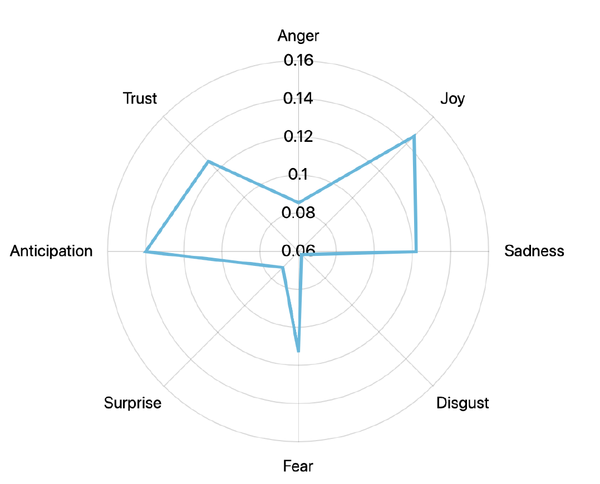
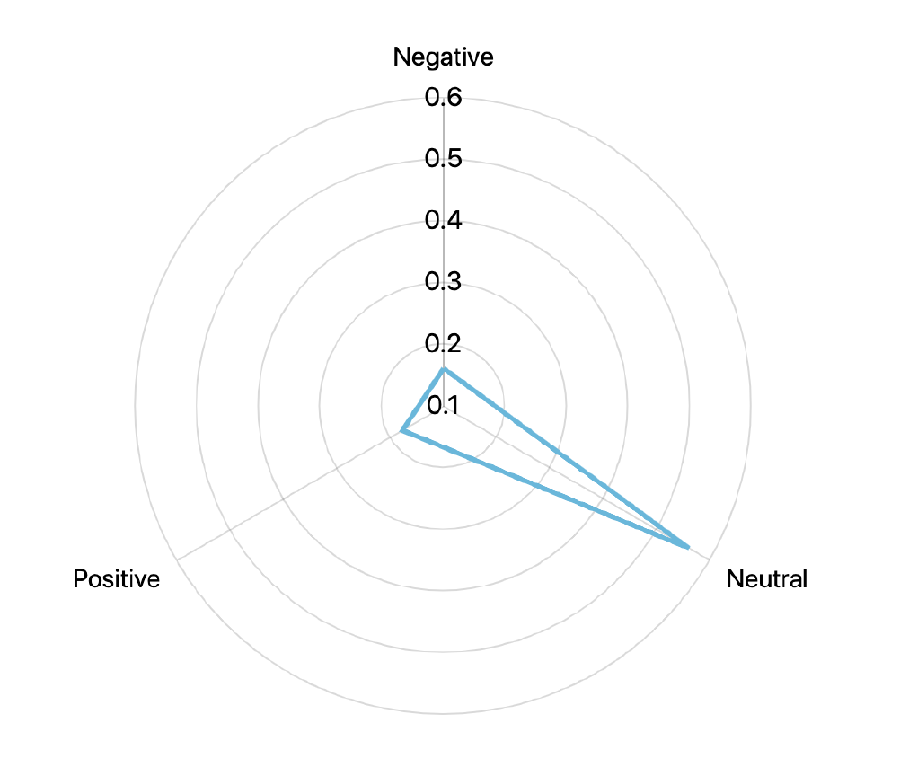

# Emolyzer
This is a set of Python functions and scripts that aid in the process of getting Last.FM user listening history, web-crawling lyrics of the songs using Genius and scoring them using emotional and sentiment analysis. The output is a .CSV with the song names, artist names, lyrics, url of the lyrics and the scoring proportions!

# Technologies and Resources Used
* Python
* Genius API: https://www.last.fm/api
* Last.FM API: https://docs.genius.com/
* NRC Emotion Lexicon: https://saifmohammad.com/WebPages/NRC-Emotion-Lexicon.htm
* AmChart - Radar Chart : https://www.amcharts.com/demos/radar-chart/
* Two Million Last.FM User Profile Dataset: https://opendata.socrata.com/Business/Two-Million-LastFM-User-Profiles/5vvd-truf
* BeautifulSoup: https://www.crummy.com/software/BeautifulSoup/bs4/doc/

I recommend setting up your accounts, client keys and tokens after giving this a brief read to see if it suits your needs.

# Overview / How it Works
The first step of the process is to retrieve the listening history of users that are found in the Two Million Last.FM User Profile (TMLUP) dataset. The API allows you to get the entire users listening history but the Python library import I used only allows you to get 1,000 *at a time*. If you'd like more than 1,000 songs per user, you'd have to loop over the get_user_tacks() function and altering the 'time_to' parameter to the date of the most recent song retrieved from the previous get_user_tracks() return. More information on how to do this can be found at: https://github.com/pylast/pylast/issues/302

Once the song names and artist names are retrived from this portion, we then use the Genius API to create a search term including both the song name and the artist name in hopes that it will return a link to where the lyrics are located in the Genius database. If a link is retrived succesfully, we can move forward to the next step.

In this stage, we have access to a whole bunch of songs, their artists and their links. We can now visit their URL and use BeautifulSoup to navigate through the HTML tags and extract the lyrics from the inner HTML.

With an abundance of song and their lyrics, we are able to perform a variety of natural langauge process algorithms and analyses. Once the analyses is done, it stores the results in a .CSV file with the following schema:

[ ID | Artist | Song Name  | Time Listened | URL  | Lyrics | Negative  | Neutral | Positive  | Anger | Disgust | Fear | Joy | Sadness | Surprise | Anticipation | Trust ]

# Emotional and Sentiment Analysis
I wanted to study the difference between lexicon-based sentiment and emotional scoring and so I wrote a simple scoring algorithm to score the songs. It simply reads the entire song and for each word, checks the emotional and sentiment scoring in the set of unigrams from the NRC. It then scores the song based on the proportion of words that belong to each classification.

An NRC lexicon scoring sample for the word 'abandon':

| Word | Classification | Indicator
| ------- | -------------- | --------- | 
| abandon	| anger |	0 | 
| abandon	| anticipation	| 0 | 
| abandon	| disgust	| 0 | 
| abandon	| fear	| 1 | 
| abandon	| joy	| 0 | 
| abandon	| negative	| 1 | 
| abandon	| positive	| 0 | 
| abandon	| sadness	| 1 | 
| abandon	| surprise	| 0 | 
| abandon	| trust	| 0 | 

For example, take the following song by Drake called “One Dance”:

> “Got a pretty girl and she love me long time”

The emotional scoring is as follows:
_{'[anger]': 0, '[disgust]': 0, '[fear]': 0, '[joy]': 2, '[sadness]': 0, '[surprise]': 0, '[anticipation]': 3, '[trust]': 1}_

Due to the words in that line of the lyric, we matched 2 words that 

And the scoring of the entire song is as follows, after analyzing all the lines:
_{'[anger]': 0.0675, '[disgust]': 0.0540, '[fear]': 0.1621, '[joy]': 0.2297, '[sadness]': 0.0, '[surprise]': 0.0270, '[anticipation]': 0.2297, '[trust]': 0.2162}_

# Functions
Function | Description
------------- | -------------
`run()`  | Runs the entire set of operations on the correct order in order to ingest, process and store data.
`get_history()`  | Retrieves a list of song names and artists from a certain specified amount of users and a certain specified number of songs per user.
`compile_process_results()` | Simply aggregates all the results from the several processes running in parallel and returning their independent portion of the results.
`get_lyrics()` | Retrieves the lyrics of a list of songs given the artist and track title. 
`search()` | A helper function to get_lyrics() that gets the URL of the song from the Genius API.
`find_lyrics_div()` | A helper function to get_lyrics() that gets the 
 of the song from the URL it is stored in.
`emotional_analysis()` | This function performs an emotional analysis on a set of inputted lyrics.
`sentiment_analysis()` | This function performs a sentiment analysis on a set of inputted lyrics.
`analyze_songs()` | This function calls the analysis functions for each song in the list that have lyrics.
`compile_anlaysis_arguments()` | This function prepares a set of processes to split up the work for the multiprocessor library in python.
  
 
# How to Use
> `python3 emolyzer.py [NUMBER OF SONGS PER USER] [NUMBER OF USERS] [.CSV FILENAME]`

**Make sure the NRC Lexicon .txt file is in the same directory!**
 
# Analysis:
In a seperate script, I performed a Radar Chart analysis to see the proportion of songs in each classification for both the sentiment and emotional analysis. I wanted to see the spread and if emotional analysis really does provide a higher dimension of information/interpretation.

Emotional Analysis : 
Sentiment Analysis : 
  
# Limitations
The code can be quite slow depending on your connection and occasionally your device, so I did implement some multiprocessing for some functions, however, there is a potential for deadlocks. Future work includes implementing the system with a stream layer approach as opposed to a batch layer. At the moment, the script waits until all the computation and functions are done before it writes to the .CSV file, so a continous writing to the .CSV file in the case of a crash or timeout is ideal. Stay tuned :)!
